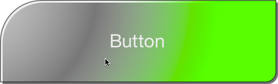
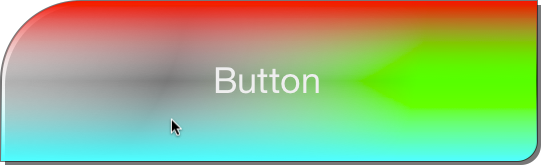

iDroid-Layout [](https://travis-ci.org/tomquist/iDroidLayout)
=============

iDroid-Layout is a port of Androids layout system and its drawable and resources framework to iOS. 

### THIS IS CURRENTLY A PRE-ALPHA EXPERIMENTAL VERSION AND THE API IS NOT STABLE. DON'T USE IT UNTIL YOU KNOW WHAT YOU ARE DOING!

Why?
----
The main reason for this project is to learn more about the Android layout system and how it works.
Another reason is the lack of a advanced layout system in iOS ( **Update:** this is not true anymore for iOS >= 6 because of the introduction of layout constraints). Currently it is a pain to build maintainable UI code in iOS. You have the choice between doing your layout in interface builder which is great for static, but not powerful enough for dynamic content, or doing all in code which is difficult to maintain.
In Android layouts can be defined in XML. Views automatically adjust their size while taking into account their content requirements and their parents' size restrictions.


Highlights
----------
- Define **layouts in XML**
- Use **native UI widgets** like UIButton, UITextField etc. and even custom subclasses of UIView within the layout XML
- Layout views linearly, right to left or top to bottom (__LinearLayout__)
- Layout views relatively to each other and to their parents (__RelativeLayout__)
- Add views to **UIScrollViews** and let them automatically adjust their content size according to your layout
- Extend the layout system by implementing **custom layout containers**
- Load dynamic xml layouts within **Interface Builder**
- Maintain your resources using a powerful **resource manager**
- Define maintainable **graphics in XML** which are rendered live at runtime
- Support for **[9-Patch](http://developer.android.com/tools/help/draw9patch.html) PNGs**

Getting started
---------------

iDroidLayout can be installed using CocoaPods:

#### Podfile

```ruby
pod 'iDroidLayout'
```

Defining and using a layout with iDroid-Layout can be done in two simple steps:

1. Create a layout xml file which contains your view hierarchy and save it as ```myLayout.xml```. E.g.

```xml
        <LinearLayout
            layout_width="match_parent"
            layout_height="wrap_content"
            orientation="vertical"
            padding="10">
            <LinearLayout
                layout_width="match_parent"
                layout_height="wrap_content"
                orientation="horizontal">
                <TextView
                    id="text"
                    layout_width="wrap_content"
                    layout_height="wrap_content"
                    padding="10"
                    text="Some text"
                    textColor="#ffffff"
                    background="#80000000"/>
                <TextView
                    id="otherText"
                    layout_width="match_parent"
                    layout_height="match_parent"
                    padding="10"
                    textColor="#ffffff"
                    background="#ff0000"
                    gravity="right"
                    text="Some other text"/>
            </LinearLayout>
            <UIButton
                id="button"
                background="#ff0000"
                layout_width="100"
                layout_height="30"
                layout_gravity="center_horizontal"
                layout_marginTop="10"
                text="Click me"/>
        </LinearLayout>
```

2. Create an instance of IDLLayoutViewController:

```objc
        IDLLayoutViewController *vc = [[IDLLayoutViewController alloc] initWithLayoutName:@"myLayout" bundle:nil];
        [self.navigationController pushViewController:vc animated:TRUE];
```
        
3. Enjoy:

    
    
Resources
---------
iDroid-Layout contains an advanced resource resolution framework. It allows you to reference resources like images, layouts, strings, colors and styles. Resources identifiers allow to (cross-)reference resources. E.g. it allows you to specify texts and images for views within layouts.

##### Resource-Identifier Syntax
The syntax of a resource identifier is the following:
``[<bundle-identifier>:]<resource-type>/<resource-name>[.<resource-subname>]``
- ``<bundle-identifier>`` is the identifier of the bundle which contains the resource. If the bunde-identifier is ommitted, the resource will be searched within the main bundle. To use bundles other than the main bundle, you have to load the bundle at least once before a resource identifier whith this bundle is used.
- ``<resource-type>`` is the resource type (one of ``string``, ``layout``, ``drawable``, ``color`` or ``style``)
- ``<resource-name>`` is the name of te resource file
- ``<resource-subname>`` is an identifier of the specific resource within the resource file. This is only used for some resource types which act as a resource container.

Drawables
---------
A drawable is an abstract concept for something that can be drawn on the screen. This could be a simple raster graphics, a color, a shape or a combination of these. The following types of drawables are currently implemented:

**Bitmap**
> A bitmap graphics (e.g. png, jpg) which can also be a 9-patch graphics

**Layer List**
> A Drawable that manages an array of other Drawables. These are drawn in array order, so the element with the largest index is be drawn on top

**State List**
> A Drawable that is references other drawables depending on the drawables state (e.g. to draw different images for different button states).

**Inset Drawable**
> Drawable that insets another drawable

**Clip Drawable**
> Drawable that clips another drawable depending on the drawables level

**Shape Drawable**
> Draws a geometric shape which can be filles with a colors or a gradient

Drawables can be defined in XML and can be inflated into a drawable object tree. Here is an example:

```xml
    <layer-list>
        <item left="12" top="12" right="8" bottom="8">
            <shape shape="rectangle">
                <solid color="#8000"/>
                <corners topLeftRadius="40" bottomRightRadius="10"/>
            </shape>
        </item>
        <item left="10" top="10" right="10" bottom="10">
            <shape shape="rectangle" thicknessRatio="8" innerRadiusRatio="3">
                <gradient centerX="-0.1" centerY="-0.1" gradientRadius="300%" type="radial" startColor="#ccc" centerColor="#0fff" endColor="#0f0"/>
                <corners topLeftRadius="40" bottomRightRadius="10"/>
                <stroke width="1" color="#8000"/>
                <padding left="5"/>
            </shape>
        </item>
        <item>
            <selector>
                <item state_pressed="true">
                    <inset insetLeft="10" insetTop="10" insetRight="10" insetBottom="10">
                    <shape shape="rectangle">
                        <gradient startColor="#f00" centerColor="#0fff" endColor="#0ff"/>
                        <corners topLeftRadius="40" bottomRightRadius="10"/>
                    </shape>
                    </inset>
                </item>
            </selector
        </item>
    </layer-list>
```

Assuming you saved the drawable XML into the file ``background.xml``. Now you can define a button like this in your layout:

```xml
    <Button
        textColor="#eee"
        layout_width="match_parent"
        layout_height="100"
        layout_gravity="center"
        background="@drawable/background"
        text="Button"/>
```



**Fig1:** Button with a custom drawable as background in normal state



**Fig2:** Button with a custom drawable as background in pressed state

Questions & Answers
-------------------
##### I don't want my whole view hierarchy to be loaded from a layout XML. How can I load a layout into a specific part of my existing view hierarchy?
``IDLLayoutBridge`` is a UIView which acts as a bridge between the plain old view layout mechanism and the iDroid-Layout mechanism. First you have to create an IDLLayoutBridge object and add it to your view hierarchy. Now you can load the xml layout into the ``IDLLayoutBridge`` view using ``IDLLayoutInflater``:

```objc
    IDLLayoutBridge *bridge = [[IDLLayoutBridge alloc] initWithFrame:CGRectMake(100, 100, 120, 220)];
    IDLLayoutInflater *inflater = [[IDLLayoutInflater alloc] init];
    [inflater inflateURL:[[NSBundle mainBundle] URLForResource:@"myLayout" withExtension:@"xml"] intoRootView:bridge attachToRoot:TRUE];
    [self.view addSubview:bridge];
```

##### Can I use native views?
Yes, you can use native views. Simply use the class name of the view as the xml tag name (e.g. ``<UIButton/>``). However, for some of the native views the ``onMeasureWithWidthMeasureSpec:heightMeasureSpec:`` selector is not yet implemented, so you should not use ``wrap_content`` for the view's width and height.

##### Can I use custom views?
Yes, simply use the class name of the view as the xml tag name (e.g. ``<MyCustomView/>``). However, you should implement the ``onMeasureWithWidthMeasureSpec:heightMeasureSpec:`` selector. Otherwise you should not use ``wrap_content`` for the views' width and height.

##### My custom view should not be initialized using init (like the ``IDLLayoutInflater`` usually does). How can I implement a custom initialization?
``IDLLayoutInflater`` creates view objects using a default implementation of the ``IDLViewFactory`` protocol. You can implement a custom view factory by implementing the protocol and setting the ``viewFactory`` property of the ``IDLLayoutInflater``.

##### Can I use XML layouts in ``UITableViewCell``s?
Yes, you can either use ``IDLTableViewCell`` or create a custom UITableViewCell where you inflate your layout into an ``IDLLayoutBridge``.

##### Can I load xml layouts into a view defined in a xib file?
Yes, a layout xml file can be inflated into a view in interface builder. Simple add a plain view in interface builder, set ``IDLLayoutBridge`` as custom class of the newly added view and define a user defined runtime attribute with the name ``layout`` and the name of the xml file (without the file extension) as the value. Check out the example project for more details.

##### Can I re-use layouts within other layouts?
Similar to the android layouting system, you can embed other layouts within a layout XML file using the ``<include />`` and ``<merge />`` tags. Inside the layout to which you want to add the re-usable component, add the <include/> tag. Here's an example:

```xml
    <LinearLayout
        layout_width="match_parent"
        layout_height="match_parent"
        orientation="vertical">
        
        <include layout="@layout/layoutToInclude"/>
        
        <TextView
            layout_width="match_parent"
            layout_height="wrap_content"
            text="Some text"/>
    </LinearLayout>
```
    
You can also override all the layout parameters (any ``layout_*`` attributes), the id and the visibility of the included layout's root view by specifying them in the ``<include/>`` tag. For example:

```xml
    <include id="title"
             layout_width="match_parent"
             layout_height="match_parent"
             layout="@layout/layoutToInclude"
             visibility="gone"/>
```

XML files always need a single root element. If you have to include multiple views from another single layout file, you need a container as a root element. This is where the ``<merge />`` tag comes into play. It allows you to include multiple views at once, without the need of an extra layout container:

```xml
    <merge>
        <TextView
            layout_width="match_parent"
            layout_height="wrap_content"
            text="First text view"/>
        <TextView
            layout_width="match_parent"
            layout_height="wrap_content"
            text="Second text view"/>
    </merge>
```

Now, when you include this layout in another layout (using the ``<include/>`` tag), the system ignores the ``<merge />`` element and places the two text views directly in the layout, in place of the ``<include/>`` tag.
